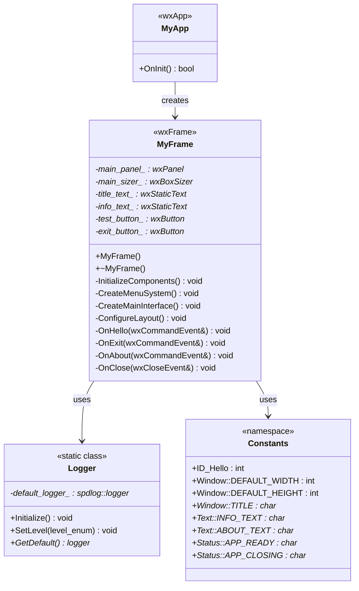
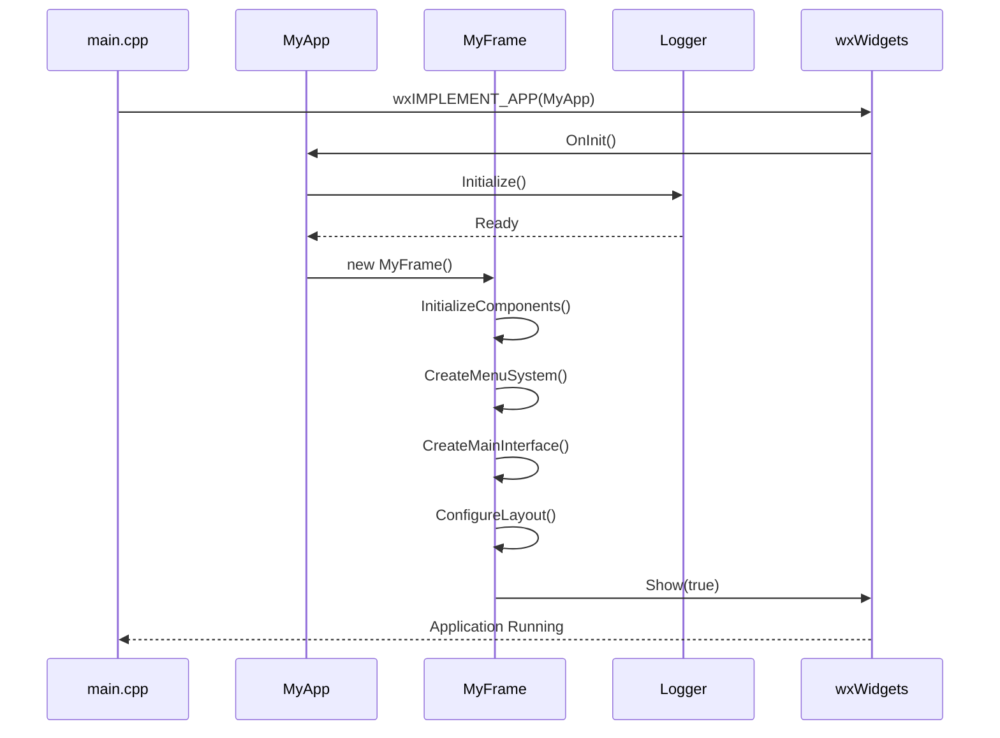
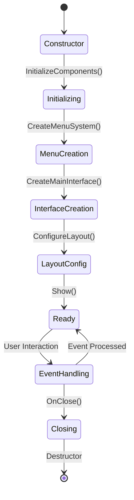
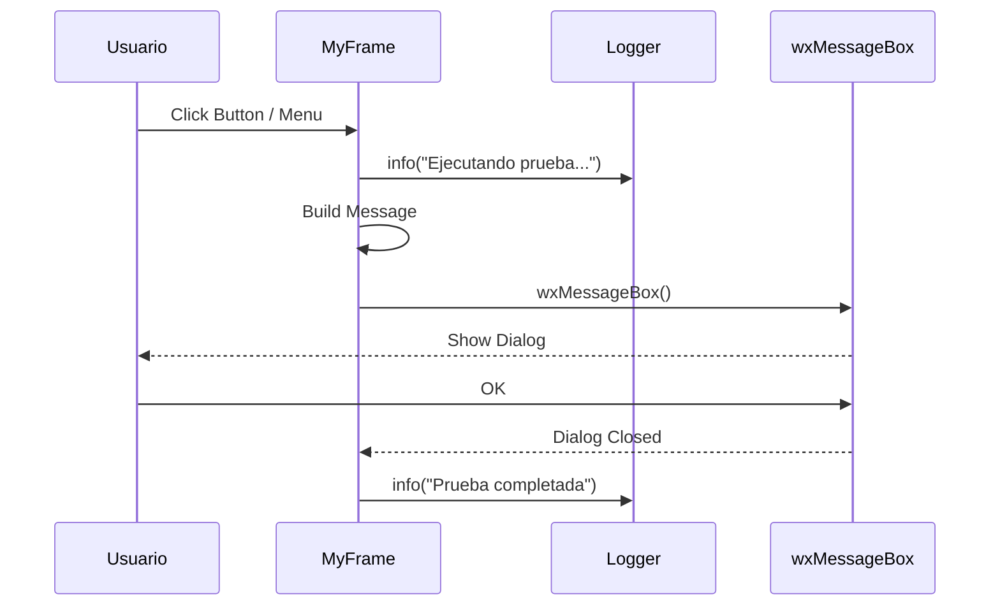
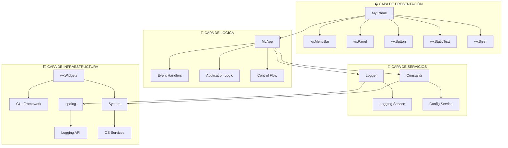
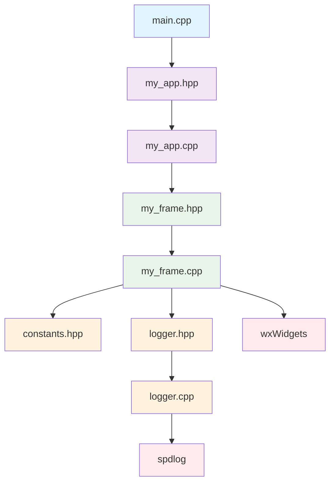
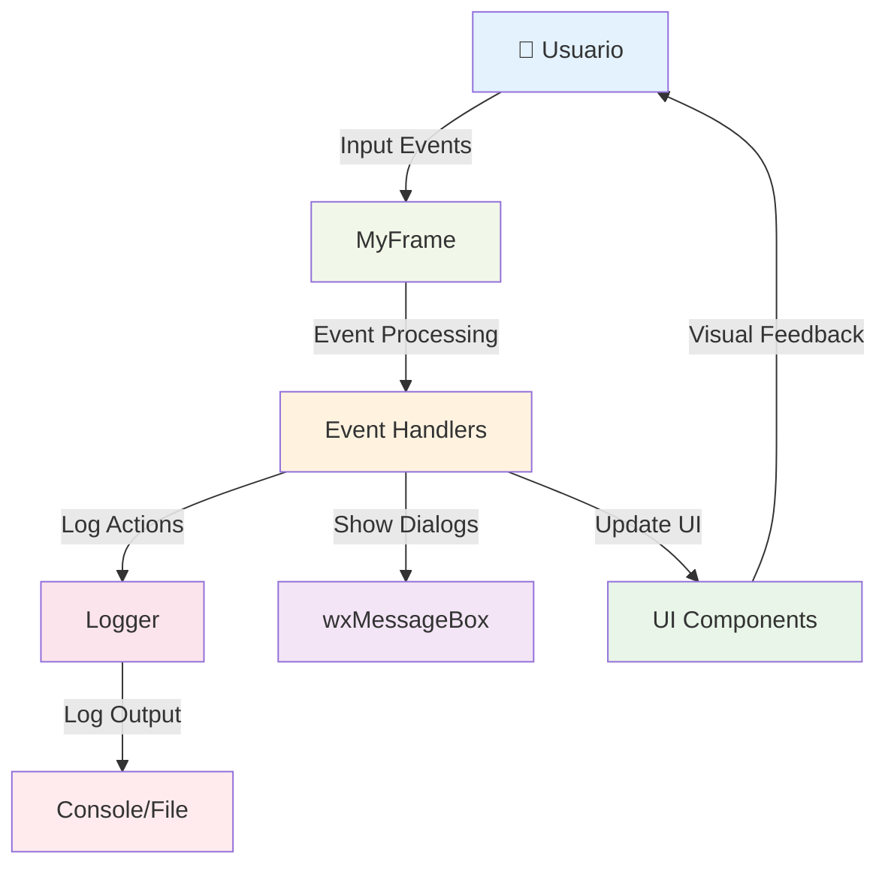
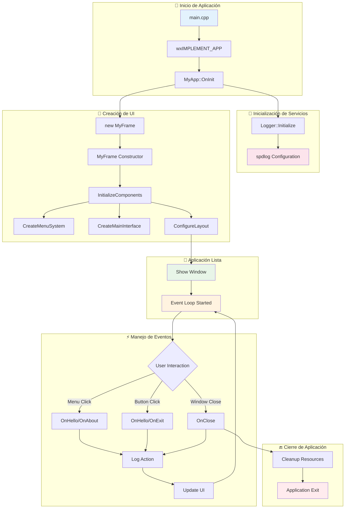

# 🏗️ Diagramas de Arquitectura - Aplicación wxWidgets Modular

## 📊 Diagrama de Clases UML

## 🔄 Diagrama de Secuencia - Inicialización

## 📱 Diagrama de Estados - MyFrame

## 🎯 Diagrama de Interacciones - Evento OnHello

     │        ## 🏛️ Arquitectura por Capas

## 🔗 Diagrama de Dependencias

## 📈 Flujo de Datos

## 🔄 Diagrama de Flujo Completo de la Aplicación

---

**🎯 Estos diagramas muestran la estructura completa y las interacciones de la aplicación wxWidgets**
