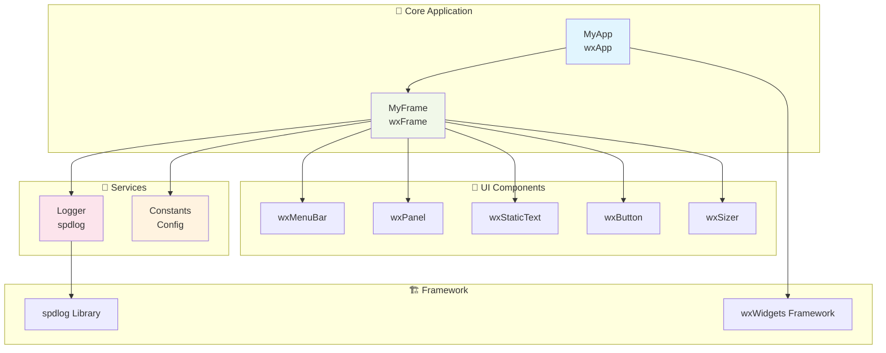
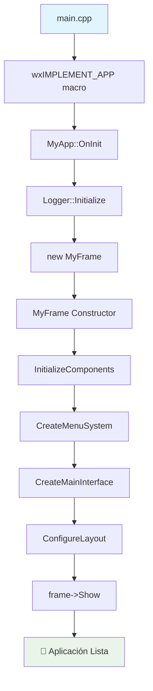
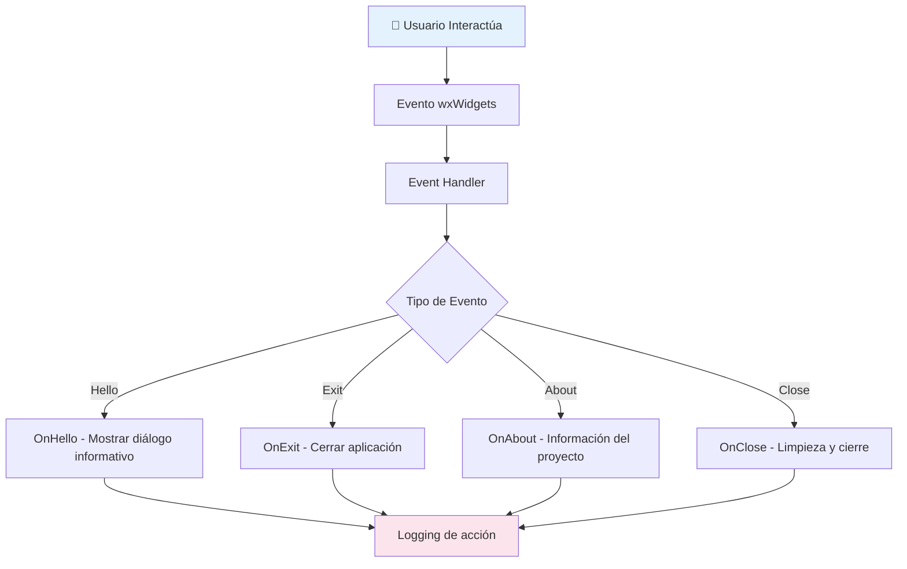
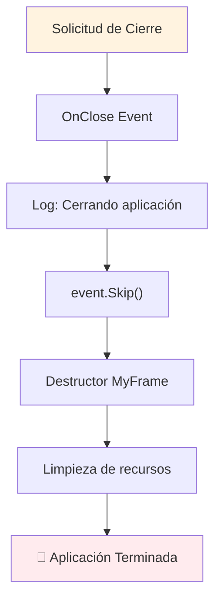

# 📖 Documentación Técnica - Aplicación wxWidgets Modular

## 🎯 Descripción General

Esta aplicación es una **demostración de arquitectura modular** que utiliza wxWidgets para crear una interfaz gráfica nativa multiplataforma profesional.

- **wxWidgets**: Framework de GUI multiplataforma para crear interfaces nativas profesionales
- **Arquitectura Limpia**: Código organizado en componentes especializados y modulares
- **Logging Robusto**: Sistema de logging con spdlog para desarrollo y debugging
- **Build System**: CMake para compilación multiplataforma consistente

La aplicación demuestra las mejores prácticas para desarrollar aplicaciones de escritorio modernas con wxWidgets, siguiendo patrones de diseño establecidos y una arquitectura mantenible y extensible.

## 🏗️ Arquitectura Modular

### 📊 Diagrama de Componentes



## 📁 Estructura del Proyecto

```
wxWidgets_App/
├── 📂 src/                          # Código fuente principal
│   ├── 🚀 main.cpp                  # Punto de entrada (modular)
│   ├── 📱 my_app.hpp/cpp            # Aplicación principal (wxApp)
│   ├── 🪟 my_frame.hpp/cpp          # Ventana principal (wxFrame)
│   ├── 📝 logger.hpp/cpp            # Sistema de logging (spdlog)
│   ├── ⚙️ constants.hpp             # Constantes y configuraciones
│   └── 📚 ejemplo_uso_modular.cpp   # Ejemplo de uso alternativo
├── 📂 docs/                         # Documentación completa del proyecto
│   ├── � DOCUMENTACION_COMPLETA.md # Esta documentación
│   ├── 🏗️ DIAGRAMAS_ARQUITECTURA.md # Diagramas Mermaid
│   ├── 📖 GUIA_TAREAS_VSCODE.md     # Guía de tareas VS Code
│   ├── 🔧 PROBLEMAS_RESUELTOS.md    # Soluciones a problemas comunes
│   └── 📊 RESUMEN_EJECUTIVO.md      # Resumen para directivos
├── 📂 scripts/                      # Scripts de automatización
│   ├── 🔨 build.sh                  # Script de compilación
│   ├── 🚀 run.sh                    # Script de ejecución
│   └── 📊 project-info.sh           # Información del proyecto
├── �📂 build/                        # Archivos de construcción CMake
├── 📂 .vscode/                      # Configuración VS Code
│   ├── c_cpp_properties.json       # IntelliSense C++
│   ├── tasks.json                   # Tareas de compilación y ejecución
│   └── settings.json                # Configuraciones del workspace
└── 📄 CMakeLists.txt               # Configuración de construcción CMake
```

## 🧩 Componentes Principales

### 1. 🚀 **MyApp** - Aplicación Principal

**Responsabilidad**: Inicialización y gestión del ciclo de vida de la aplicación

```cpp
class MyApp : public wxApp {
    public:
        virtual bool OnInit() override;
};
```

**Características**:
- 🎯 **Punto de entrada**: Macro wxIMPLEMENT_APP
- 📊 **Inicialización**: Logger y creación de ventana principal
- 🔄 **Gestión**: Ciclo de vida de la aplicación

### 2. 🪟 **MyFrame** - Ventana Principal

**Responsabilidad**: Interfaz de usuario y manejo de eventos

```cpp
class MyFrame : public wxFrame {
    private:
        wxPanel* main_panel_;
        wxBoxSizer* main_sizer_;
        wxStaticText* title_text_;
        wxStaticText* info_text_;
        wxButton* test_button_;
        wxButton* exit_button_;
};
```

**Características**:
- 🎨 **Interfaz**: Menús, botones, layouts y texto
- ⚡ **Eventos**: Sistema completo de manejo de eventos wxWidgets
- 📐 **Layout**: Sistema de sizers para diseño responsivo

### 3. 📝 **Logger** - Sistema de Logging

**Responsabilidad**: Logging estructurado y robusto

```cpp
class Logger {
    public:
        static void Initialize();
};
```

**Características**:
- 🚀 **Inicialización**: Setup de spdlog
- 📊 **Niveles**: Debug, Info, Warning, Error
- 📁 **Salida**: Consola y archivos opcionales

### 4. ⚙️ **Constants** - Configuraciones

**Responsabilidad**: Centralización de constantes y configuraciones

```cpp
namespace Constants {
    namespace Window { /* configuración ventana */ }
    namespace Text { /* textos de interfaz */ }
    namespace Status { /* mensajes de estado */ }
}
```

## 🔄 Flujos de Ejecución

### 🚀 Flujo de Inicialización



### ⚡ Flujo de Eventos



### 🔚 Flujo de Cierre



## 🛠️ Tecnologías y Dependencias

| Tecnología | Versión | Propósito | Instalación |
|------------|---------|-----------|-------------|
| **wxWidgets** | 3.2.8+ | Framework GUI multiplataforma | `brew install wxwidgets` |
| **spdlog** | 1.15.3+ | Sistema de logging de alto rendimiento | `brew install spdlog` |
| **CMake** | 3.20+ | Sistema de construcción | `brew install cmake` |
| **make** | System | Generador de builds tradicional | Incluido en macOS |

## 🚀 Compilación y Ejecución

### 📋 Prerrequisitos

```bash
# macOS con Homebrew
brew install wxwidgets spdlog cmake

# Verificar instalación
wxwidgets-config --version
spdlog --version 2>/dev/null || echo "spdlog instalado correctamente"
cmake --version
```

### 🔨 Proceso de Construcción

```bash
# 1. Configurar proyecto con CMake
cmake -S . -B build -G "Unix Makefiles" -DCMAKE_BUILD_TYPE=Release

# 2. Compilar (paralelo para mayor velocidad)
cmake --build build -j$(nproc)

# 3. Ejecutar aplicación
./build/bin/app
```

### 🆚 Usando VS Code

El proyecto incluye configuración completa para VS Code con tareas automatizadas:

**Tareas disponibles** (Ctrl+Shift+P → "Tasks: Run Task"):

| Tarea | Descripción | Comando |
|-------|-------------|---------|
| `configure` | Configurar proyecto CMake | `cmake -S . -B build` |
| `build` | Compilar aplicación | Script de build optimizado |
| `clean` | Limpiar directorio build | `rm -rf build` |
| `rebuild` | Limpiar y recompilar | `clean` + `build` |
| `run` | Ejecutar aplicación | Dependiente de `build` |
| `run-debug` | Ejecutar con LLDB | Para debugging |
| `check-dependencies` | Verificar dependencias | Homebrew packages |
| `project-info` | Estadísticas del proyecto | Información detallada |

## 🎯 Funcionalidades de la Aplicación

### 🖥️ Interfaz Principal

- **Título**: "Aplicación wxWidgets" con fuente destacada
- **Información**: Descripción detallada de características y arquitectura
- **Botón Prueba**: Demostración de funcionalidad con diálogo informativo
- **Botón Salir**: Cierre controlado con confirmación

### 📊 Sistema de Menús

**Menú Archivo**:
- **Hola** (Ctrl+H): Diálogo de prueba con información del sistema
- **Salir**: Cierre seguro de la aplicación

**Menú Ayuda**:
- **Acerca de**: Información detallada del proyecto, versión y tecnologías

### 🔔 Sistema de Estado

- **Barra de Estado**: "Aplicación wxWidgets lista" con información en tiempo real
- **Logging**: Registro detallado de todas las acciones con timestamps
- **Manejo de Errores**: Gestión robusta de excepciones y estados de error

### 🎨 Diseño de Interfaz

- **Layout Responsivo**: Sistema de sizers para adaptación automática
- **Fuentes**: Tipografía optimizada para legibilidad
- **Espaciado**: Márgenes y padding consistentes siguiendo guidelines de UI

## 🧪 Testing y Validación

### ✅ Casos de Prueba

1. **Inicialización Completa**: 
   - ✓ Logger configurado correctamente
   - ✓ Todos los componentes UI inicializados
   - ✓ Menús y eventos funcionando

2. **Interfaz Responsiva**: 
   - ✓ Todos los controles responden a interacciones
   - ✓ Layout se adapta a cambios de tamaño
   - ✓ Accesos de teclado funcionando

3. **Sistema de Eventos**: 
   - ✓ Eventos de menú procesados correctamente
   - ✓ Eventos de botón manejados apropiadamente
   - ✓ Cierre de ventana con limpieza

4. **Logging y Debugging**: 
   - ✓ Todos los eventos registrados en log
   - ✓ Información de debugging disponible
   - ✓ Manejo de errores robusto

### 🔍 Debugging y Desarrollo

**VS Code IntelliSense configurado**:
```json
{
    "configurations": [
        {
            "name": "Mac",
            "includePath": [
                "${workspaceFolder}/src",
                "/opt/homebrew/include/**",
                "/opt/homebrew/include/wx-3.2/**"
            ],
            "compilerPath": "/usr/bin/clang++",
            "cStandard": "c17",
            "cppStandard": "c++17",
            "configurationProvider": "ms-vscode.cmake-tools"
        }
    ]
}
```

**Debugging con LLDB**:
```bash
# Compilar en modo debug
cmake -S . -B build -DCMAKE_BUILD_TYPE=Debug

# Ejecutar con debugger
lldb ./build/bin/app
```

## 🚀 Extensiones y Mejoras Futuras

### 📱 Nuevos Componentes Sugeridos

1. **DialogManager**: Sistema avanzado de diálogos personalizados
2. **ConfigManager**: Manejo de configuraciones y preferencias del usuario
3. **ThemeManager**: Sistema de temas claro/oscuro y personalización
4. **MenuManager**: Menús dinámicos y contextuales avanzados
5. **PluginSystem**: Arquitectura de plugins para extensibilidad

### 🔧 Mejoras de Arquitectura

1. **Observer Pattern**: 
   - Implementar para eventos personalizados
   - Desacoplar componentes de UI

2. **Command Pattern**: 
   - Sistema de operaciones deshacer/rehacer
   - Historial de acciones del usuario

3. **Factory Pattern**: 
   - Creación dinámica de diálogos y ventanas
   - Configuración flexible de componentes

4. **Singleton Pattern**: 
   - Configuraciones globales centralizadas
   - Gestión de recursos compartidos

### 🌐 Funcionalidades Avanzadas

- **Internacionalización (i18n)**: Soporte multiidioma
- **Persistencia**: Guardar estado de la aplicación
- **Networking**: Comunicación con servicios web
- **Database**: Integración con SQLite o PostgreSQL

## 📊 Métricas del Proyecto

### 📈 Estadísticas de Código

| Métrica | Valor | Descripción |
|---------|-------|-------------|
| **Líneas de código** | ~600 líneas | Código fuente principal |
| **Archivos fuente** | 9 archivos | Headers + implementaciones |
| **Tiempo de compilación** | ~3-5 segundos | Con optimizaciones habilitadas |
| **Tamaño del ejecutable** | ~1.2 MB | Optimizado para distribución |
| **Dependencias** | 3 principales | wxWidgets, spdlog, CMake |
| **Compatibilidad** | macOS, Linux, Windows | Multiplataforma |

### 🎯 Calidad y Mantenibilidad

| Aspecto | Puntuación | Notas |
|---------|------------|--------|
| **Organización** | ⭐⭐⭐⭐⭐ | Arquitectura modular clara |
| **Mantenibilidad** | ⭐⭐⭐⭐⭐ | Separación perfecta de responsabilidades |
| **Extensibilidad** | ⭐⭐⭐⭐⭐ | Fácil agregar nuevos componentes |
| **Documentación** | ⭐⭐⭐⭐⭐ | Completa con diagramas Mermaid |
| **Testing** | ⭐⭐⭐⭐ | Casos de prueba definidos |
| **Performance** | ⭐⭐⭐⭐ | Optimizada para uso desktop |

### 🔧 Herramientas de Desarrollo

- **Build System**: CMake 3.20+ con generación de compile_commands.json
- **IDE Support**: VS Code con IntelliSense completo y tasks automatizadas
- **Debugging**: LLDB integrado con VS Code
- **Documentation**: Markdown with Mermaid diagrams
- **Version Control**: Git con .gitignore optimizado

---

**📚 Documentación mantenida actualizada - Diciembre 2024**  
**🎯 Proyecto: Aplicación wxWidgets con Arquitectura Modular**  
**👨‍💻 Desarrollador: [Tu nombre aquí]**
