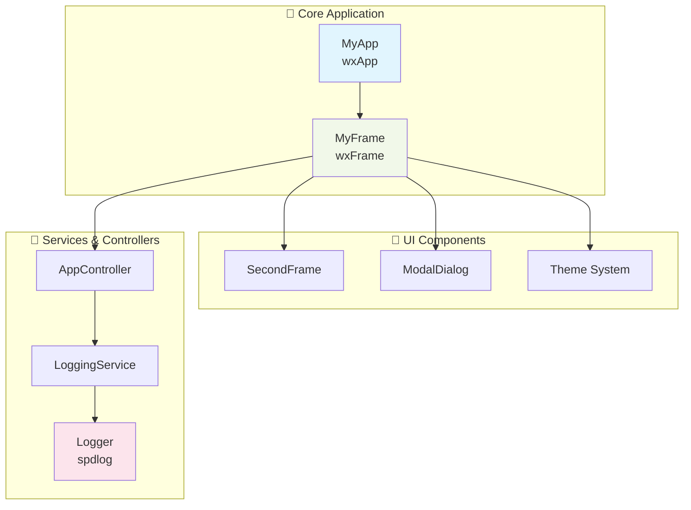
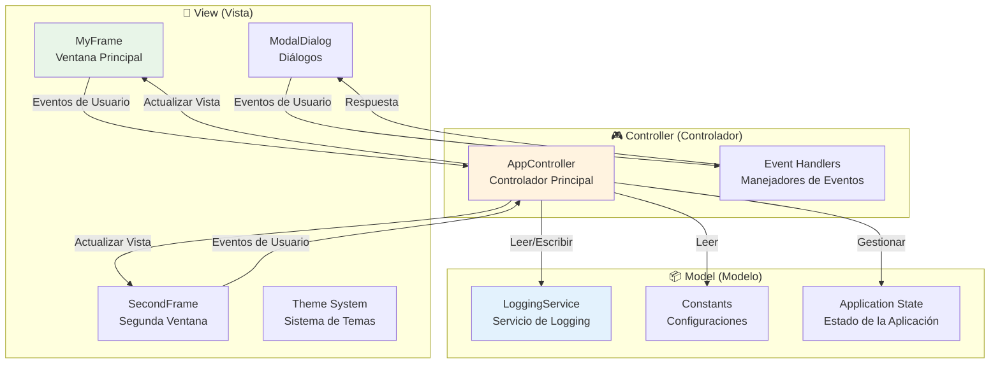
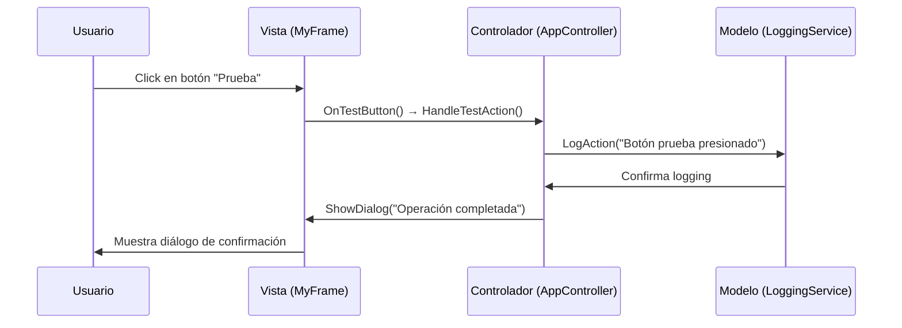

# 📖 Documentación Técnica - SignaturePro

## 🎯 Descripción General

SignaturePro es una aplicación de demostración que utiliza **wxWidgets** para crear una interfaz gráfica nativa multiplataforma profesional con:

- **Arquitectura modular** y mantenible
- **Tema oscuro moderno** 
- **Sistema de logging robusto** con spdlog
- **Build system** CMake multiplataforma

## 🏗️ Arquitectura

### Diagrama de Componentes



## 🧩 Componentes Principales

### 1. **MyApp** - Aplicación Principal
```cpp
class MyApp : public wxApp {
    public:
        virtual bool OnInit() override;
};
```
- Punto de entrada (wxIMPLEMENT_APP)
- Inicialización de logger y ventana principal

### 2. **MyFrame** - Ventana Principal
```cpp
class MyFrame : public wxFrame {
    private:
        wxPanel* main_panel_;
        wxBoxSizer* main_sizer_;
        // Componentes UI
};
```
- Interfaz principal con menús y botones
- Sistema de eventos wxWidgets

### 3. **Logger** - Sistema de Logging
```cpp
class Logger {
    public:
        static void Initialize();
        static void Info/Warning/Error(const std::string&);
};
```
- Logging estructurado con spdlog
- Niveles: Debug, Info, Warning, Error

### 4. **Constants** - Configuraciones
- Centralización de constantes de ventana, colores y textos
- Facilita mantenimiento y modificaciones

## 🏛️ Arquitectura MVC Simplificada

SignaturePro implementa una **arquitectura MVC (Model-View-Controller) simplificada** adaptada para aplicaciones de escritorio wxWidgets:

### 📊 Diagrama MVC



### 🎯 Implementación MVC en SignaturePro

#### **📱 View (Vista) - Capa de Presentación**
```cpp
// src/ui/my_frame.cpp - Vista principal
class MyFrame : public wxFrame {
private:
    // Componentes UI
    wxPanel* main_panel_;
    wxButton* test_button_;
    wxButton* exit_button_;
    
public:
    // Solo maneja presentación, delega lógica al controlador
    void OnTestButton(wxCommandEvent& event);
    void OnExitButton(wxCommandEvent& event);
};
```

**Responsabilidades de la Vista:**
- Renderizar la interfaz de usuario
- Capturar eventos de interacción del usuario
- Mostrar información al usuario
- Aplicar temas y estilos visuales

#### **🎮 Controller (Controlador) - Lógica de Negocio**
```cpp
// src/controllers/app_controller.cpp - Controlador principal
class AppController {
private:
    LoggingService* logging_service_;
    
public:
    void HandleTestAction();
    void HandleExitAction();
    void ShowDialog(const std::string& message);
    void LogAction(const std::string& action);
};
```

**Responsabilidades del Controlador:**
- Procesar eventos de la vista
- Coordinar operaciones entre vista y modelo
- Implementar lógica de negocio
- Gestionar flujo de la aplicación

#### **📦 Model (Modelo) - Datos y Servicios**
```cpp
// src/services/logging_service.cpp - Servicio del modelo
class LoggingService {
public:
    void LogInfo(const std::string& message);
    void LogWarning(const std::string& message);
    void LogError(const std::string& message);
};

// src/core/constants.hpp - Configuraciones del modelo
namespace Constants {
    namespace Window {
        const int DEFAULT_WIDTH = 800;
        const int DEFAULT_HEIGHT = 600;
    }
}
```

**Responsabilidades del Modelo:**
- Gestionar datos de la aplicación
- Proveer servicios (logging, configuración)
- Mantener estado de la aplicación
- Realizar operaciones de persistencia

### 🔄 Flujo de Datos MVC



### ✅ Ventajas de esta Arquitectura MVC

1. **🔄 Separación de Responsabilidades**
   - Vista: Solo presentación e interacción
   - Controlador: Lógica de negocio centralizada
   - Modelo: Datos y servicios especializados

2. **🧪 Testabilidad Mejorada**
   - Controladores pueden probarse independientemente
   - Servicios del modelo son reutilizables
   - Vista queda simple y enfocada en UI

3. **📈 Escalabilidad**
   - Fácil añadir nuevas vistas (ventanas)
   - Controladores modulares por funcionalidad
   - Servicios del modelo extensibles

4. **🔧 Mantenibilidad**
   - Cambios en UI no afectan lógica de negocio
   - Lógica centralizada en controladores
   - Configuraciones y servicios centralizados

### 🎯 Aplicación Práctica en SignaturePro

**Ejemplo: Acción de "Prueba"**
1. **Vista**: `MyFrame` captura click del botón
2. **Controlador**: `AppController::HandleTestAction()` procesa la acción
3. **Modelo**: `LoggingService` registra la acción
4. **Vista**: Muestra diálogo de confirmación al usuario

Este patrón se repite consistentemente en toda la aplicación, manteniendo la arquitectura limpia y predecible.

## 🎯 Patrones de Diseño Implementados

SignaturePro utiliza varios patrones de diseño reconocidos que mejoran la calidad y mantenibilidad del código:

### 1. **🏛️ MVC (Model-View-Controller)**
- **Vista**: Componentes UI (MyFrame, SecondFrame, ModalDialog)
- **Controlador**: Lógica de negocio (AppController)
- **Modelo**: Servicios y datos (LoggingService, Constants)

### 2. **🔧 RAII (Resource Acquisition Is Initialization)**
```cpp
// Gestión automática de recursos wxWidgets
class MyFrame : public wxFrame {
    // Los componentes UI se liberan automáticamente
    ~MyFrame() { /* Destrucción automática */ }
};
```

### 3. **👁️ Observer Pattern**
```cpp
// Sistema de eventos wxWidgets
void MyFrame::OnTestButton(wxCommandEvent& event) {
    // Respuesta a evento observado
    app_controller_->HandleTestAction();
}
```

### 4. **🏭 Service Locator**
```cpp
// Centralización de servicios
class AppController {
private:
    LoggingService* logging_service_;  // Servicio localizado
    // Otros servicios...
};
```

### 5. **📋 Command Pattern (Implícito)**
```cpp
// Eventos wxWidgets encapsulan acciones
wxCommandEvent → HandleTestAction()
wxCloseEvent → HandleExitAction()
```

## 🛠️ Tecnologías y Dependencias

| Tecnología | Versión | Propósito |
|------------|---------|-----------|
| **wxWidgets** | 3.2.8+ | Framework GUI multiplataforma |
| **spdlog** | 1.15.3+ | Sistema de logging de alto rendimiento |
| **CMake** | 3.20+ | Sistema de construcción |

## 🚀 Características de la Aplicación

### Interfaz Principal
- Título y descripción informativa
- Botones de prueba y salida
- Menús: Archivo (Hola, Salir) y Ayuda (Acerca de)
- Barra de estado con información en tiempo real

### Funcionalidades
- Tema oscuro moderno aplicado consistentemente
- Sistema de logging con timestamps
- Diálogos informativos y de confirmación
- Navegación multi-ventana (MyFrame, SecondFrame, ModalDialog)

---

**Documentación técnica de SignaturePro** - Una aplicación de demostración wxWidgets con arquitectura MVC modular, tema oscuro y sistema de logging robusto.
