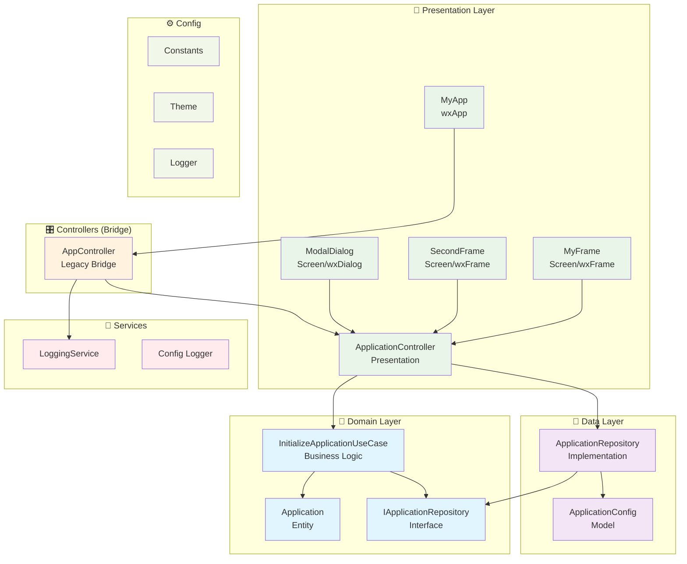
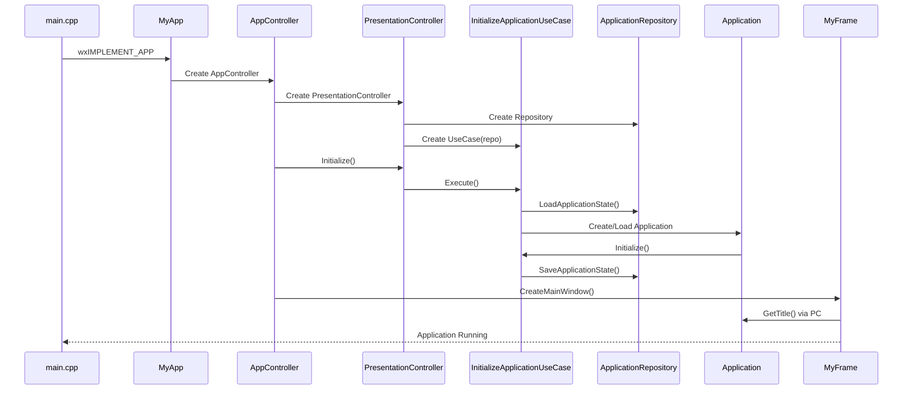
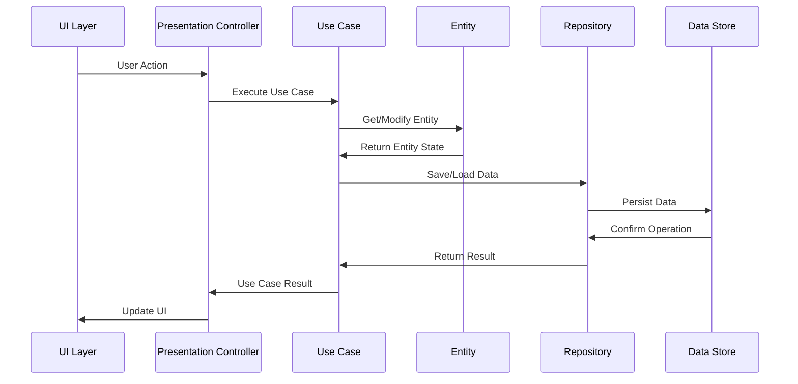
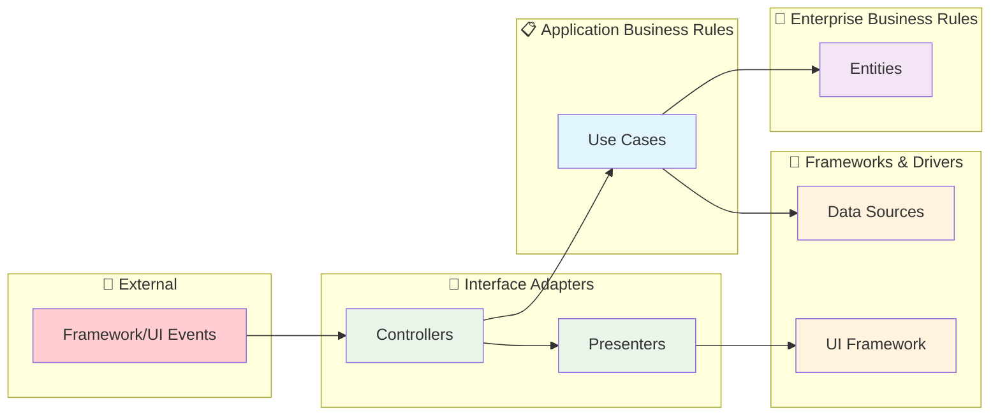

# 📖 Documentación Técnica - SignaturePro

## 🎯 Descripción General

SignaturePro es una aplicación profesional que implementa **Clean Architecture** utilizando **wxWidgets** para crear una interfaz gráfica nativa multiplataforma con:

- **Clean Architecture** siguiendo principios de Robert C. Martin
- **Separación de capas** bien definidas (Domain, Data, Presentation, UI)
- **Tema oscuro moderno** integrado
- **Sistema de logging robusto** con spdlog
- **Build system** CMake multiplataforma optimizado

## 🏗️ Clean Architecture Implementada

### Diagrama de Capas - Clean Architecture



## 🧩 Componentes Principales

### 1. **MyApp** - Aplicación Principal
```cpp
class MyApp : public wxApp {
    public:
        virtual bool OnInit() override;
};
```
- Punto de entrada (wxIMPLEMENT_APP)
- Inicialización de logger y ventana principal

### 2. **MyFrame** - Ventana Principal
```cpp
class MyFrame : public wxFrame {
## 🧩 Componentes por Capas - Clean Architecture

### 🎯 **Domain Layer** - Lógica de Negocio Pura

#### **Application Entity**
```cpp
namespace Domain::Entities {
    class Application {
        public:
            void Initialize();
            void Shutdown();
            AppState GetState() const;
            const std::string& GetTitle() const;
    };
}
```
- **Responsabilidad**: Estado central y lógica de negocio
- **Características**: Independiente de frameworks y tecnología

#### **IApplicationRepository Interface**
```cpp
namespace Domain::Repositories {
    class IApplicationRepository {
        public:
            virtual bool SaveApplicationState(const Application& app) = 0;
            virtual std::unique_ptr<Application> LoadApplicationState() = 0;
    };
}
```
- **Responsabilidad**: Contrato para persistencia de datos
- **Características**: Define operaciones sin implementación

#### **InitializeApplicationUseCase**
```cpp
namespace Domain::UseCases {
    class InitializeApplicationUseCase {
        public:
            bool Execute();
            std::shared_ptr<Application> GetApplication() const;
    };
}
```
- **Responsabilidad**: Lógica de inicialización de la aplicación
- **Características**: Orquesta entidades y repositorios

### 💾 **Data Layer** - Manejo de Datos

#### **ApplicationRepository Implementation**
```cpp
namespace Data::Repositories {
    class ApplicationRepository : public Domain::Repositories::IApplicationRepository {
        public:
            bool SaveApplicationState(const Application& app) override;
            std::unique_ptr<Application> LoadApplicationState() override;
    };
}
```
- **Responsabilidad**: Implementación concreta de persistencia
- **Características**: Maneja almacenamiento (actualmente en memoria)

#### **ApplicationConfig Model**
```cpp
namespace Data::Models {
    struct ApplicationConfigModel {
        std::string title;
        int window_width, window_height;
        std::string theme;
    };
}
```
- **Responsabilidad**: Modelo de datos para serialización
- **Características**: DTO para persistencia

### 🎨 **Presentation Layer** - Coordinación

#### **ApplicationController (Presentation)**
```cpp
namespace Presentation::Controllers {
    class ApplicationController {
        public:
            bool Initialize();
            std::shared_ptr<Domain::Entities::Application> GetApplication() const;
    };
}
```
- **Responsabilidad**: Coordina entre UI y casos de uso
- **Características**: Orquesta el flujo de presentación

#### **MyApp - Aplicación Principal**
```cpp
class MyApp : public wxApp {
    public:
        virtual bool OnInit() override;
    private:
        std::unique_ptr<AppController> app_controller_;
};
```
- **Responsabilidad**: Punto de entrada de wxWidgets

#### **Screens - Componentes Visuales**

##### **MyFrame - Ventana Principal**
```cpp
class MyFrame : public wxFrame {
    private:
        wxPanel* main_panel_;
        wxBoxSizer* main_sizer_;
        // Componentes UI preservados
};
```
- **Responsabilidad**: Interfaz principal con menús y botones
- **Características**: Sistema de eventos wxWidgets completo

##### **SecondFrame y ModalDialog**
- **SecondFrame**: Ventana secundaria con navegación
- **ModalDialog**: Diálogo modal para interacciones específicas
- **Responsabilidad**: Componentes visuales especializados

###  **Services Layer** - Servicios Transversales

#### **LoggingService**
```cpp
class LoggingService {
    public:
        void LogInfo/Warning/Error(const std::string&);
        bool Initialize();
};
```
- **Responsabilidad**: Logging estructurado con spdlog
- **Características**: Niveles: Debug, Info, Warning, Error

### ⚙️ **Config Layer** - Configuración y Utilidades

#### **Constants & Theme**
- **Constants**: Centralización de configuraciones de ventana, colores y textos
- **Theme**: Sistema de tema oscuro moderno
- **Características**: Facilita mantenimiento y modificaciones


### 🎯 Implementación Clean Architecture en SignaturePro

#### **� Estructura de Capas del Proyecto**

```
src/
├── 📱 main.cpp                         # Punto de entrada
├── 🎯 domain/                         # DOMAIN LAYER
│   ├── entities/
│   │   └── application.hpp/cpp        # Entidad principal
│   ├── repositories/
│   │   └── application_repository.hpp # Interfaz de repositorio
│   └── usecases/
│       └── initialize_application.hpp/cpp # Caso de uso
├── 💾 data/                          # DATA LAYER
│   ├── models/
│   │   └── application_config.hpp/cpp # Modelo de datos
│   └── repositories/
│       └── application_repository.hpp/cpp # Implementación
├── 🎨 presentation/                   # PRESENTATION LAYER
│   ├── my_app.hpp/cpp                 # Aplicación wxWidgets
│   ├── controllers/
│   │   └── application_controller.hpp/cpp # Controlador de presentación
│   └── screens/                       # Pantallas y componentes visuales
│       ├── my_frame.hpp/cpp           # Ventana principal
│       ├── second_frame.hpp/cpp       # Segunda ventana
│       └── modal_dialog.hpp/cpp       # Diálogo modal
├── 🎛️ controllers/                   # BRIDGE CONTROLLERS
│   └── app_controller.hpp/cpp         # Puente legacy
├── 🔧 services/                       # SERVICES LAYER
│   └── logging_service.hpp/cpp        # Servicio de logging
└── ⚙️ config/                        # CONFIGURACIÓN Y UTILIDADES
    ├── constants.hpp                  # Constantes
    ├── theme.hpp                      # Sistema de tema
    └── logger.hpp/cpp                 # Logger base
```

#### **🎯 Domain Layer - Lógica de Negocio Pura**
```cpp
// src/domain/entities/application.cpp - Entidad central
namespace Domain::Entities {
    class Application {
    private:
        std::string title_;
        AppState state_;
        bool initialized_;
        
    public:
        void Initialize();
        void Shutdown();
        AppState GetState() const;
        const std::string& GetTitle() const;
    };
}

// src/domain/usecases/initialize_application.cpp - Caso de uso
namespace Domain::UseCases {
    class InitializeApplicationUseCase {
    public:
        bool Execute();
        std::shared_ptr<Entities::Application> GetApplication() const;
    };
}
```

**Responsabilidades del Domain Layer:**
- Definir entidades de negocio independientes de tecnologia
- Implementar casos de uso que orquestan la lógica del negocio
- Establecer contratos (interfaces) para operaciones externas
- Mantener la pureza de la lógica de negocio

#### **💾 Data Layer - Manejo de Persistencia**
```cpp
// src/data/repositories/application_repository.cpp - Implementación
namespace Data::Repositories {
    class ApplicationRepository : public Domain::Repositories::IApplicationRepository {
    public:
        bool SaveApplicationState(const Domain::Entities::Application& app) override;
        std::unique_ptr<Domain::Entities::Application> LoadApplicationState() override;
    };
}

// src/data/models/application_config.cpp - Modelo de datos
namespace Data::Models {
    struct ApplicationConfigModel {
        std::string title;
        int window_width, window_height;
        std::string theme;
    };
}
```

**Responsabilidades del Data Layer:**
- Implementar interfaces de repositorios definidas en Domain
- Manejar serialización/deserialización de datos
- Gestionar acceso a fuentes de datos (archivos, base de datos, APIs)
- Proveer modelos de datos (DTOs) para transferencia

#### **🎨 Presentation Layer - Coordinación de Flujos**
```cpp
// src/presentation/controllers/application_controller.cpp - Coordinador
namespace Presentation::Controllers {
    class ApplicationController {
    private:
        std::shared_ptr<Data::Repositories::ApplicationRepository> app_repository_;
        std::unique_ptr<Domain::UseCases::InitializeApplicationUseCase> initialize_use_case_;
        
    public:
        bool Initialize();
        std::shared_ptr<Domain::Entities::Application> GetApplication() const;
        void SetApplicationTitle(const std::string& title);
    };
}

// src/presentation/my_app.cpp - Aplicación principal
class MyApp : public wxApp {
public:
    bool OnInit() override {
        app_controller_ = std::make_unique<AppController>();
        return app_controller_->Initialize();
    }
};
```

**Responsabilidades del Presentation Layer:**
- Coordinar entre UI y casos de uso del dominio
- Gestionar flujos de presentación específicos
- Transformar datos del dominio para la UI
- Manejar estado de presentación

#### **🖥️ UI Layer - Interfaz Visual**
```cpp
// src/presentation/screens/my_frame.cpp - Vista principal (preservada completamente)
class MyFrame : public wxFrame {
private:
    // Componentes UI preservados
    wxPanel* main_panel_;
    wxButton* test_button_;
    wxButton* exit_button_;
    
public:
    // Eventos UI - delegados a controladores
    void OnTestButton(wxCommandEvent& event);
    void OnExitButton(wxCommandEvent& event);
};
```

**Responsabilidades del UI Layer:**
- Renderizar la interfaz de usuario con wxWidgets
- Capturar eventos de interacción del usuario
- Aplicar temas y estilos visuales
- Mostrar información procesada desde capas superiores

### 🔄 Flujo de Inicialización - Clean Architecture



### 🎯 Flujo de Casos de Uso



### ✅ Ventajas de Clean Architecture

1. **🎯 Inversión de Dependencias**
   - Capas externas dependen de internas
   - Lógica de negocio independiente de frameworks
   - Interfaces definen contratos claros

2. **🧪 Testabilidad Superior**
   - Casos de uso testables independientemente
   - Repositorios mockeable para testing
   - Entidades puras sin dependencias externas

3. **📈 Escalabilidad Empresarial**
   - Agregar nuevos casos de uso sin modificar UI
   - Cambiar fuentes de datos sin afectar lógica
   - Múltiples interfaces (CLI, GUI, Web) usando mismo core

4. **🔧 Mantenibilidad Avanzada**
   - Cambios en frameworks no afectan dominio
   - Lógica de negocio centralizada en casos de uso
   - Evolución independiente de cada capa

5. **🔄 Reutilización de Código**
   - Dominio reutilizable en diferentes aplicaciones
   - Casos de uso independientes de tecnología
   - Repositorios intercambiables
   - Configuraciones y servicios centralizados

## 🏛️ Clean Architecture - Implementación Completa

SignaturePro demuestra una **implementación completa de Clean Architecture** manteniendo la funcionalidad original pero con una estructura profesional y escalable.

### 🎯 Principios Fundamentales Aplicados

#### **1. Dependency Inversion Principle**
```cpp
// Domain define la interfaz
namespace Domain::Repositories {
    class IApplicationRepository {
        virtual bool SaveApplicationState(const Application& app) = 0;
    };
}

// Data implementa la interfaz
namespace Data::Repositories {
    class ApplicationRepository : public Domain::Repositories::IApplicationRepository {
        bool SaveApplicationState(const Application& app) override;
    };
}
```

#### **2. Single Responsibility Principle**
- **Entities**: Solo lógica de negocio
- **Use Cases**: Solo orquestación de casos de uso
- **Repositories**: Solo persistencia
- **Controllers**: Solo coordinación

#### **3. Open/Closed Principle**
- Extensible para nuevos casos de uso
- Cerrado para modificaciones en código existente
- Nuevas funcionalidades via nuevos Use Cases

### 🔄 Flujo de Datos Clean Architecture



### 📦 Beneficios Empresariales Obtenidos

#### **🧪 Testabilidad Superior**
```cpp
// Test del caso de uso aislado
TEST(InitializeApplicationUseCase, ShouldInitializeSuccessfully) {
    auto mockRepo = std::make_shared<MockApplicationRepository>();
    auto useCase = InitializeApplicationUseCase(mockRepo);
    
    EXPECT_TRUE(useCase.Execute());
    EXPECT_NE(useCase.GetApplication(), nullptr);
}
```

#### **🔄 Flexibilidad de Implementación**
```cpp
// Cambiar persistencia sin afectar lógica
auto fileRepo = std::make_shared<FileApplicationRepository>();     // Archivos
auto dbRepo = std::make_shared<DatabaseApplicationRepository>();   // Base de datos
auto cloudRepo = std::make_shared<CloudApplicationRepository>();   // Cloud

// Mismo use case, diferentes implementaciones
auto useCase = InitializeApplicationUseCase(fileRepo);  // O dbRepo, o cloudRepo
```

#### **📈 Escalabilidad de Equipos**
- **Frontend Team**: Trabaja en UI Layer sin afectar lógica
- **Backend Team**: Modifica Data Layer sin impactar UI
- **Business Team**: Define nuevos Use Cases independientemente
- **QA Team**: Testea cada capa por separado

### 🛠️ Herramientas de Desarrollo Clean Architecture

#### **CMakeLists.txt Organizado por Capas**
```cmake
# Domain Layer - Pure Business Logic
src/domain/entities/application.cpp
src/domain/usecases/initialize_application.cpp

# Data Layer - External Interfaces
src/data/repositories/application_repository.cpp
src/data/models/application_config.cpp

# Presentation Layer - Application Coordinators  
src/presentation/controllers/application_controller.cpp

# UI Layer - Framework Specific
src/presentation/screens/my_frame.cpp
src/presentation/screens/second_frame.cpp
src/presentation/screens/modal_dialog.cpp
```

#### **Dependency Flow Verificado**
- ✅ UI depends on Presentation
- ✅ Presentation depends on Domain
- ✅ Data implements Domain interfaces
- ✅ No reverse dependencies
- ✅ Clean boundaries maintained

### 🎊 Resultado Final

SignaturePro ahora representa un **ejemplo completo de Clean Architecture empresarial** que:

- ✅ **Mantiene 100% funcionalidad original**
- ✅ **Implementa arquitectura profesional**
- ✅ **Facilita testing automatizado**
- ✅ **Permite escalabilidad de equipos**
- ✅ **Soporta evolución tecnológica**
- ✅ **Demuestra mejores prácticas**

**La aplicación funciona exactamente igual pero ahora con una base arquitectónica sólida para crecimiento empresarial.**

---
