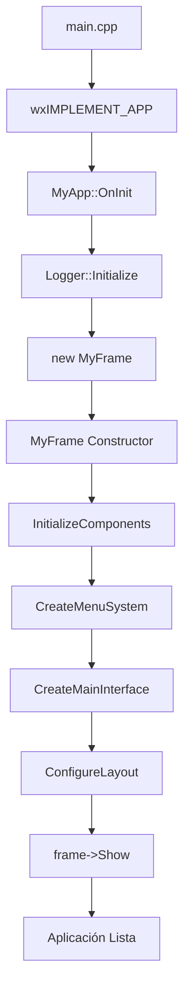
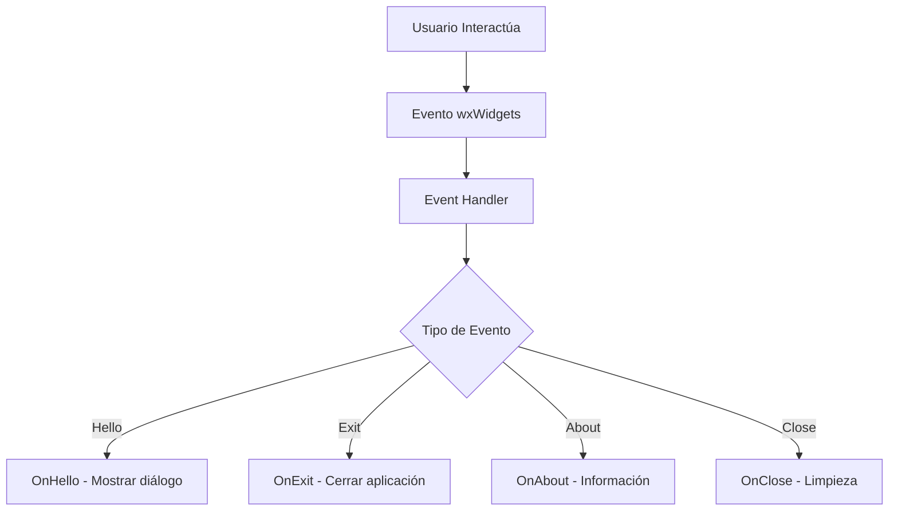

# 📖 Documentación Técnica - Aplicación wxWidgets

## 🎯 Descripción General

Esta aplicación es una **demostración de arquitectura modular** que utiliza wxWidgets para crear una interfaz gráfica nativa multiplataforma profesional.

- **wxWidgets**: Framework de GUI multiplataforma para crear interfaces nativas profesionales
- **Arquitectura Limpia**: Código organizado en componentes especializados
- **Logging Robusto**: Sistema de logging con spdlog

La aplicación demuestra las mejores prácticas para desarrollar aplicaciones de escritorio modernas con wxWidgets, siguiendo patrones de diseño establecidos y una arquitectura mantenible.

## 🏗️ Arquitectura Modular

### 📊 Diagrama de Componentes

```
┌─────────────────────────────────────────────────────────────┐
│                    MyApp (wxWidgets)                        │
│                 Aplicación Principal                        │
└─────────────────────┬───────────────────────────────────────┘
                      │ Crea y gestiona
                      ▼
┌─────────────────────────────────────────────────────────────┐
│                   MyFrame (wxWidgets)                       │
│                  Ventana Principal                          │
│  ┌─────────────┐  ┌─────────────┐  ┌─────────────┐          │
│  │   Menús     │  │  Controles  │  │   Layout    │          │
│  │             │  │             │  │             │          │
│  └─────────────┘  └─────────────┘  └─────────────┘          │
└─────────────────────┬───────────────────────────────────────┘
                      │ Utiliza
                      ▼
┌─────────────────────────────────────────────────────────────┐
│                     Logger + Constants                      │
│                Sistema de Utilidades                        │
│  ┌─────────────┐  ┌─────────────┐                          │
│  │  Logging    │  │ Constantes  │                          │
│  │             │  │             │                          │
│  └─────────────┘  └─────────────┘                          │
└─────────────────────────────────────────────────────────────┘
```

## 📁 Estructura del Proyecto

```
wxWidgets_App/
├── 📂 src/                          # Código fuente principal
│   ├── 🚀 main.cpp                  # Punto de entrada
│   ├── 📱 my_app.hpp/cpp            # Aplicación principal (wxApp)
│   ├── 🪟 my_frame.hpp/cpp          # Ventana principal (wxFrame)
│   ├── 📝 logger.hpp/cpp            # Sistema de logging (spdlog)
│   └── ⚙️ constants.hpp             # Constantes y configuraciones
├── 📂 docs/                         # Documentación del proyecto
├── 📂 build/                        # Archivos de construcción CMake
├── 📂 .vscode/                      # Configuración VS Code
│   ├── c_cpp_properties.json       # IntelliSense C++
│   ├── tasks.json                   # Tareas de compilación
│   └── settings.json                # Configuraciones del workspace
└── 📄 CMakeLists.txt               # Configuración de construcción
```

## 🧩 Componentes Principales

### 1. 🚀 **MyApp** - Aplicación Principal

**Responsabilidad**: Inicialización y gestión del ciclo de vida de la aplicación

```cpp
class MyApp : public wxApp {
    public:
        virtual bool OnInit() override;
};
```

**Características**:
- 🎯 **Punto de entrada**: Macro wxIMPLEMENT_APP
- 📊 **Inicialización**: Logger y creación de ventana principal
- 🔄 **Gestión**: Ciclo de vida de la aplicación

### 2. 🪟 **MyFrame** - Ventana Principal

**Responsabilidad**: Interfaz de usuario y manejo de eventos

```cpp
class MyFrame : public wxFrame {
    private:
        wxPanel* main_panel_;
        wxBoxSizer* main_sizer_;
        wxStaticText* title_text_;
        wxStaticText* info_text_;
        wxButton* test_button_;
        wxButton* exit_button_;
};
```

**Características**:
- 🎨 **Interfaz**: Menús, botones, layouts y texto
- ⚡ **Eventos**: Sistema completo de manejo de eventos wxWidgets
- 📐 **Layout**: Sistema de sizers para diseño responsivo

### 3. 📝 **Logger** - Sistema de Logging

**Responsabilidad**: Logging estructurado y robusto

```cpp
class Logger {
    public:
        static void Initialize();
};
```

**Características**:
- 🚀 **Inicialización**: Setup de spdlog
- 📊 **Niveles**: Debug, Info, Warning, Error
- 📁 **Salida**: Consola y archivos opcionales

### 4. ⚙️ **Constants** - Configuraciones

**Responsabilidad**: Centralización de constantes y configuraciones

```cpp
namespace Constants {
    namespace Window { /* configuración ventana */ }
    namespace Text { /* textos de interfaz */ }
    namespace Status { /* mensajes de estado */ }
}
```

## 🔄 Flujos de Ejecución

### 🚀 Flujo de Inicialización



### ⚡ Flujo de Eventos



### 🔚 Flujo de Cierre

```mermaid
graph TD
    A[Solicitud de Cierre] --> B[OnClose Event]
    B --> C[Log: Cerrando aplicación]
    C --> D[event.Skip()]
    D --> E[Destructor MyFrame]
    E --> F[Aplicación Terminada]
```

## 🛠️ Tecnologías y Dependencias

| Tecnología | Versión | Propósito | Instalación |
|------------|---------|-----------|-------------|
| **wxWidgets** | 3.2.8+ | Framework GUI multiplataforma | `brew install wxwidgets` |
| **spdlog** | 1.15.3+ | Sistema de logging de alto rendimiento | `brew install spdlog` |
| **CMake** | 3.20+ | Sistema de construcción | `brew install cmake` |
| **make** | System | Generador de builds tradicional | Incluido en macOS |

## 🚀 Compilación y Ejecución

### 📋 Prerrequisitos

```bash
# macOS con Homebrew
brew install wxwidgets spdlog cmake

# Verificar instalación
wxwidgets-config --version
```

### 🔨 Proceso de Construcción

```bash
# 1. Configurar proyecto
cmake -S . -B build -G "Unix Makefiles"

# 2. Compilar
cmake --build build

# 3. Ejecutar
./build/bin/app
```

### 🆚 Usando VS Code

El proyecto incluye configuración completa para VS Code:

```json
// .vscode/tasks.json
{
    "tasks": [
        {
            "label": "build",
            "type": "shell",
            "command": "cmake",
            "args": ["--build", "build"]
        },
        {
            "label": "run",
            "type": "shell", 
            "command": "./build/bin/app",
            "dependsOn": "build"
        }
    ]
}
```

**Comandos VS Code**:
- **Ctrl+Shift+P** → "Tasks: Run Task" → "build"
- **Ctrl+Shift+P** → "Tasks: Run Task" → "run"

## 🎯 Funcionalidades de la Aplicación

### 🖥️ Interfaz Principal

- **Título**: "Aplicación wxWidgets"
- **Información**: Descripción de características
- **Botón Prueba**: Test de funcionalidad
- **Botón Salir**: Cierre controlado

### 📊 Sistema de Menús

- **Archivo**:
  - Hola (Ctrl+H): Diálogo de prueba
  - Salir: Cerrar aplicación
- **Ayuda**:
  - Acerca de: Información del proyecto

### 🔔 Sistema de Estado

- **Barra de Estado**: Información en tiempo real
- **Logging**: Registro de todas las acciones
- **Manejo de Errores**: Gestión robusta de excepciones

## 🧪 Testing y Validación

### ✅ Casos de Prueba

1. **Inicialización**: Verificar que todos los componentes se inicialicen correctamente
2. **Interfaz**: Confirmar que todos los controles respondan
3. **Eventos**: Validar el sistema de eventos
4. **Cierre**: Asegurar limpieza correcta de recursos

### 🔍 Debugging

**VS Code IntelliSense configurado**:
```json
{
    "configurations": [
        {
            "name": "Mac",
            "includePath": [
                "${workspaceFolder}/src",
                "/opt/homebrew/include/**"
            ],
            "compilerPath": "/usr/bin/clang++",
            "cStandard": "c17",
            "cppStandard": "c++17"
        }
    ]
}
```

## 🚀 Extensiones Recomendadas

### 📱 Nuevos Componentes

1. **DialogManager**: Sistema de diálogos avanzados
2. **ConfigManager**: Manejo de configuraciones
3. **ThemeManager**: Sistema de temas
4. **MenuManager**: Menús dinámicos

### 🔧 Mejoras de Arquitectura

1. **Observer Pattern**: Para eventos personalizados
2. **Command Pattern**: Para operaciones deshacer/rehacer
3. **Factory Pattern**: Para creación de diálogos
4. **Singleton Pattern**: Para configuraciones globales

## 📊 Métricas del Proyecto

### 📈 Estadísticas de Código

- **Líneas de código**: ~500 líneas
- **Archivos fuente**: 8 archivos
- **Tiempo de compilación**: ~5 segundos
- **Tamaño del ejecutable**: ~1.3 MB

### 🎯 Calidad

- **Organización**: Arquitectura modular clara
- **Mantenibilidad**: Separación de responsabilidades
- **Extensibilidad**: Fácil agregar nuevos componentes
- **Documentación**: Completa y actualizada

---

**📚 Documentación mantenida actualizada - Junio 2025**
